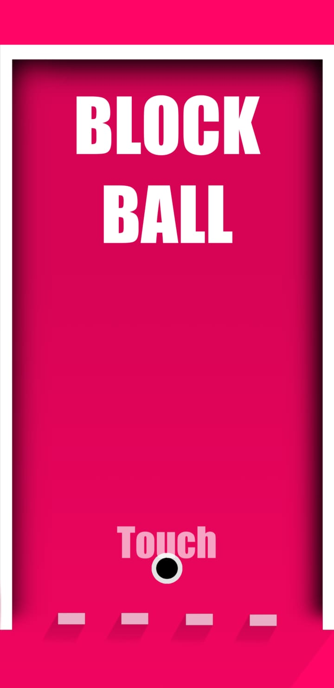
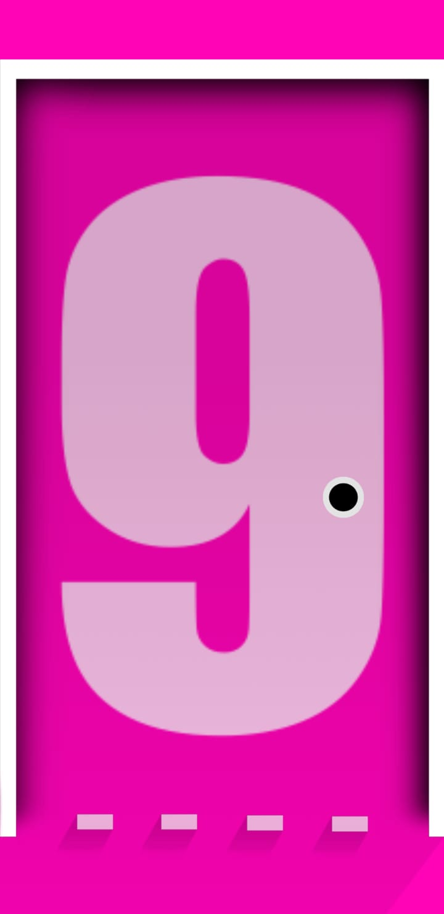
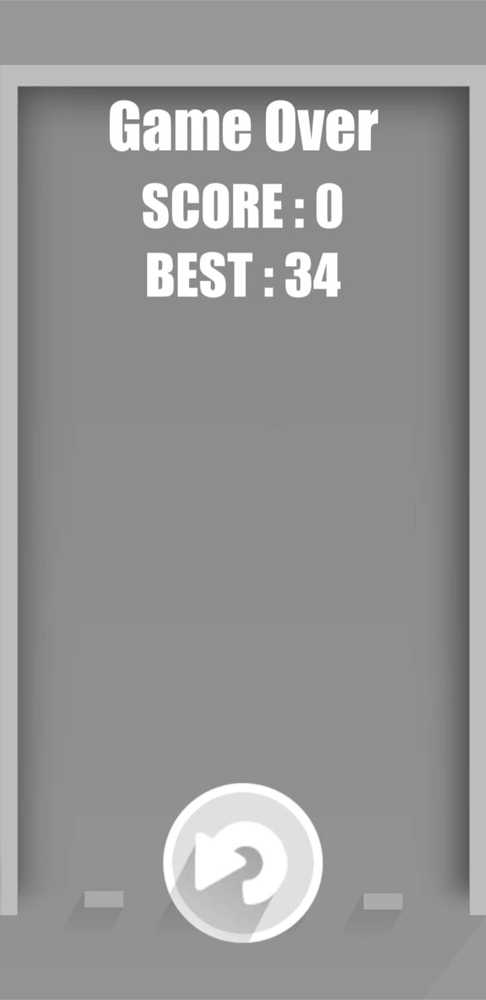

# BlockBall
Personal project on developing hyper-casual game made in Unity for Android.

## Motivation
It is a personal project developed by me in Unity. It is basically developed for enhancing my skills in Unity by having a overview on the design and implementing the experience.

# Screenshots

## License
[MIT](https://choosealicense.com/licenses/mit/)
